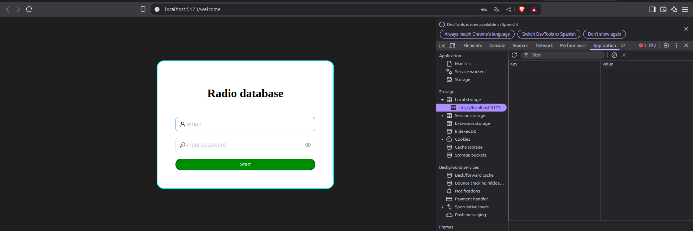
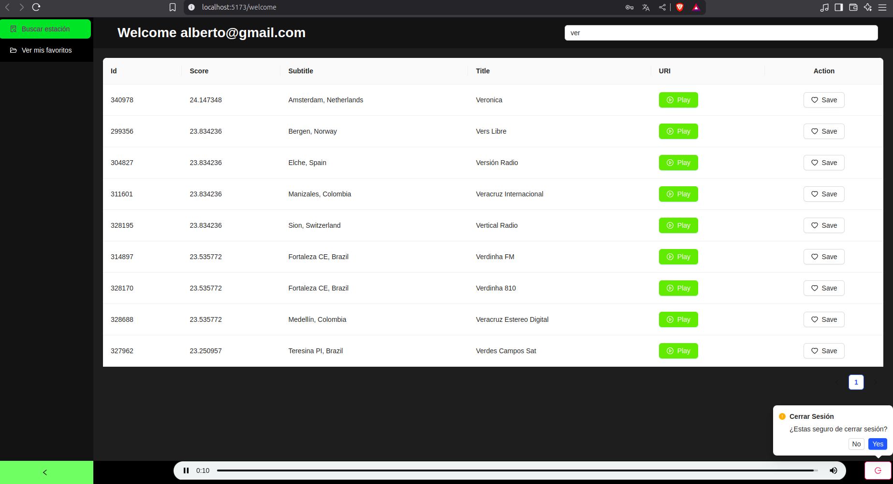
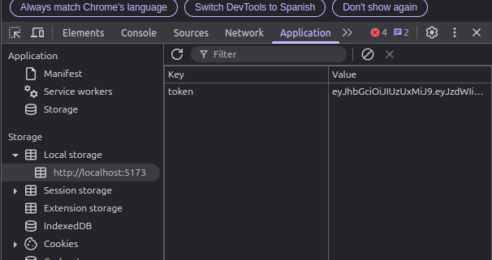

# React + Vite

This template provides a minimal setup to get React working in Vite with HMR and some ESLint rules.

Currently, two official plugins are available:

- [@vitejs/plugin-react](https://github.com/vitejs/vite-plugin-react/blob/main/packages/plugin-react) uses [Babel](https://babeljs.io/) for Fast Refresh
- [@vitejs/plugin-react-swc](https://github.com/vitejs/vite-plugin-react/blob/main/packages/plugin-react-swc) uses [SWC](https://swc.rs/) for Fast Refresh

## Expanding the ESLint configuration

If you are developing a production application, we recommend using TypeScript with type-aware lint rules enabled. Check out the [TS template](https://github.com/vitejs/vite/tree/main/packages/create-vite/template-react-ts) for information on how to integrate TypeScript and [`typescript-eslint`](https://typescript-eslint.io) in your project.

I use antd for the login page besides i use json web token(JWT) if you want to learn use jwt visit https://jwt.io/ 
however if exist an token in localstorage it will redirect to /home else it will redirect to /login

At the images you can see the login page and the another view you can see the localstorage token and we will sing in for the start session

if we close our navigator and open again we will see the home page because we have a token in localstorage
but if we close session and open again we will see the login page because we don't have a token in localstorage

All token is signed with a secret key that is stored in the .env file of server backend

## Attribution
Esta demo consume directamente los endpoints públicos de Radio Garden:
https://radio.garden/api

– Uso **no oficial**, solo para fines demostrativos y evitar CORS con un proxy Spring Boot.
– No incluye ni redistribuye el JSON de la spec de jonasrmichel.

